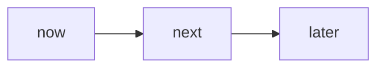

# Roadmap — <slug>

> **Status:** DRAFT · **Owner:** <owner> · **Last updated:** <YYYY-MM-DD>

## Candidate epics

<!-- RICE score = (Reach × Impact × Confidence) / Effort.
     Reach: estimated users/week. Impact: 0.25 | 0.5 | 1 | 2 | 3.
     Confidence: 50% | 80% | 100%. Effort: person-weeks. -->

| Epic | Reach | Impact | Confidence | Effort | Score | Rationale |
|------|-------|--------|------------|--------|-------|-----------|
| <epic name> | <reach> | <impact> | <confidence> | <effort> | <score> | <why this epic, why this ranking> |

## Now / Next / Later

<!-- Move epics from the table above into the appropriate horizon.
     "Now" = current quarter; "Next" = next quarter; "Later" = backlog / future. -->

